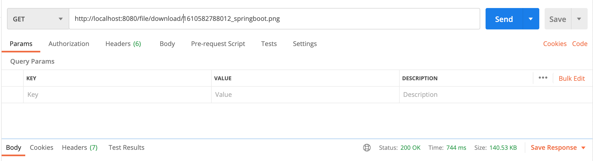

# springboot-s3-demo

### Things to do list

1. Clone this repository: `git clone https://github.com/hendisantika/springboot-s3-demo.git`
2. Go into the folder: `cd springboot-s3-demo`
3. Set Your AWS KEY & AWS SECRET in application.yml file
4. Run the application: `mvn clean spring-boot:run`
5. Open POSTMAN Application

### Screen shot

Upload File

S3 File

Download File

